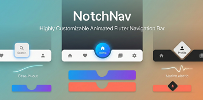
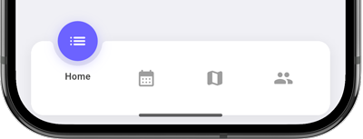
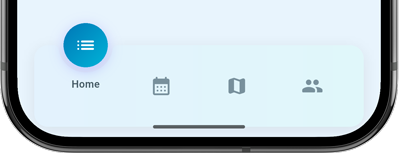
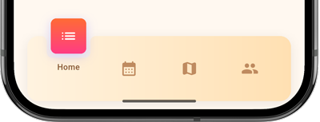
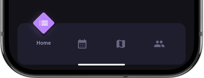
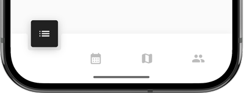
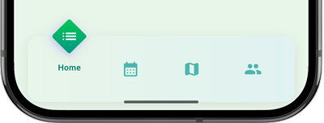
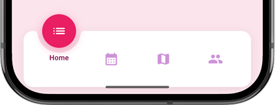
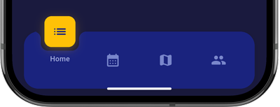

# NotchNav

A highly customizable Flutter bottom navigation bar with a notch-style pop-up indicator. The selected item rises above the bar inside an animated shape, with a smooth cutout notch in the bar background.

## Features

- Three indicator shapes: **circle**, **square**, and **diamond**
- Solid colors or **gradient** fills for both the bar and the indicator
- Configurable **animation** duration and curve
- Label visibility control (selected-only or hidden)
- Adjustable bar height, corner radius, icon size, circle size, notch margin, and more
- Smooth fillet corners on the notch cutout

## Installation

Add `notch_nav` to your `pubspec.yaml`:

```yaml
dependencies:
  notch_nav: ^0.0.1
```

Then run:

```bash
flutter pub get
```

## Quick Start

```dart
import 'package:notch_nav/notch_nav.dart';

NotchNav(
  items: const [
    NotchNavItem(icon: Icons.home, label: 'Home'),
    NotchNavItem(icon: Icons.search, label: 'Search'),
    NotchNavItem(icon: Icons.person, label: 'Profile'),
  ],
  currentIndex: _selectedIndex,
  onTap: (index) => setState(() => _selectedIndex = index),
)
```

## Customization

### Shape

Choose between `circle` (default), `square`, or `diamond`:

```dart
NotchNav(
  shape: NotchNavShape.square,
  // ...
)
```

### Colors

Set solid colors for the bar background and active indicator:

```dart
NotchNav(
  backgroundColor: Colors.white,
  activeColor: Color(0xFF6C63FF),
  activeIconColor: Colors.white,
  inactiveIconColor: Color(0xFF9E9E9E),
  labelColor: Color(0xFF424242),
  // ...
)
```

### Gradients

Use gradients instead of solid colors. When provided, they take precedence over `backgroundColor` and `activeColor`:

```dart
NotchNav(
  backgroundGradient: LinearGradient(
    colors: [Colors.blue.shade50, Colors.cyan.shade50],
  ),
  activeGradient: LinearGradient(
    colors: [Color(0xFF0077B6), Color(0xFF00B4D8)],
    begin: Alignment.topLeft,
    end: Alignment.bottomRight,
  ),
  // ...
)
```

### Animation

Control the transition speed and curve:

```dart
NotchNav(
  animationDuration: Duration(milliseconds: 600),
  animationCurve: Curves.elasticOut,
  // ...
)
```

### Label Behavior

Show labels only for the selected item, or hide them entirely:

```dart
NotchNav(
  labelBehavior: NotchNavLabelBehavior.none,
  // ...
)
```

### Sizing and Spacing

Fine-tune dimensions and layout:

```dart
NotchNav(
  barHeight: 96,
  barBorderRadius: 16,
  circleSize: 52,
  iconSize: 26,
  notchMargin: 6,
  notchCornerRadius: 6,
  margin: EdgeInsets.symmetric(horizontal: 20, vertical: 12),
  horizontalPadding: 16,
  // ...
)
```

### Shadows

Customize bar and indicator shadows:

```dart
NotchNav(
  barShadow: [
    BoxShadow(color: Colors.black12, blurRadius: 16, offset: Offset(0, 4)),
  ],
  circleShadow: [
    BoxShadow(color: Colors.purple.withValues(alpha: 0.3), blurRadius: 12),
  ],
  // ...
)
```

## Examples

| | |
|:---:|:---:|
| **Default** | **Ocean Gradient** |
|  |  |
| **Square Sunset** | **Diamond Dark** |
|  |  |
| **Square Minimal** | **Diamond Emerald** |
|  |  |
| **Bouncy Circle** | **Slow Square** |
|  |  |

##Screen record

https://github.com/user-attachments/assets/6b67c04f-50bb-4aba-83b2-0c0e9f494c5e

## All Parameters

| Parameter | Type | Default | Description |
|---|---|---|---|
| `items` | `List<NotchNavItem>` | required | Navigation items (min 2) |
| `currentIndex` | `int` | required | Selected item index |
| `onTap` | `ValueChanged<int>` | required | Tap callback |
| `shape` | `NotchNavShape` | `circle` | Indicator shape |
| `backgroundColor` | `Color` | `Colors.white` | Bar background color |
| `backgroundGradient` | `Gradient?` | `null` | Bar background gradient |
| `activeColor` | `Color` | `#6C63FF` | Indicator color |
| `activeGradient` | `Gradient?` | `null` | Indicator gradient |
| `activeIconColor` | `Color` | `Colors.white` | Selected icon color |
| `inactiveIconColor` | `Color` | `#9E9E9E` | Unselected icon color |
| `labelColor` | `Color` | `#424242` | Label text color |
| `labelStyle` | `TextStyle?` | `null` | Label text style override |
| `labelBehavior` | `NotchNavLabelBehavior` | `selectedOnly` | Label visibility |
| `alignSelectedLabel` | `bool` | `true` | Align label with icons |
| `barHeight` | `double` | `96` | Bar height |
| `barBorderRadius` | `double` | `16` | Bar corner radius |
| `circleSize` | `double` | `52` | Indicator diameter |
| `circleOffset` | `double?` | `circleSize / 2` | Rise above bar |
| `iconSize` | `double` | `26` | Icon size |
| `labelFontSize` | `double` | `12` | Label font size |
| `notchMargin` | `double` | `6` | Gap around indicator |
| `notchCornerRadius` | `double` | `6` | Notch fillet radius |
| `margin` | `EdgeInsets` | `h:20, v:12` | Outer margin |
| `horizontalPadding` | `double` | `16` | Inner horizontal padding |
| `barShadow` | `List<BoxShadow>?` | subtle shadow | Bar shadows |
| `circleShadow` | `List<BoxShadow>?` | colored shadow | Indicator shadows |
| `animationDuration` | `Duration` | `300ms` | Animation duration |
| `animationCurve` | `Curve` | `easeOutCirc` | Animation curve |

## Inspiration

Design inspired by [Habit Land - Habit Tracker App UX/UI](https://www.behance.net/gallery/139913077/Habit-Land-Habit-Tracker-App-UX-UI) on Behance by **Thu Phuong**.

<a href="https://www.behance.net/gallery/139913077/Habit-Land-Habit-Tracker-App-UX-UI">
  
  <strong>Thu Phuong</strong>
</a>
